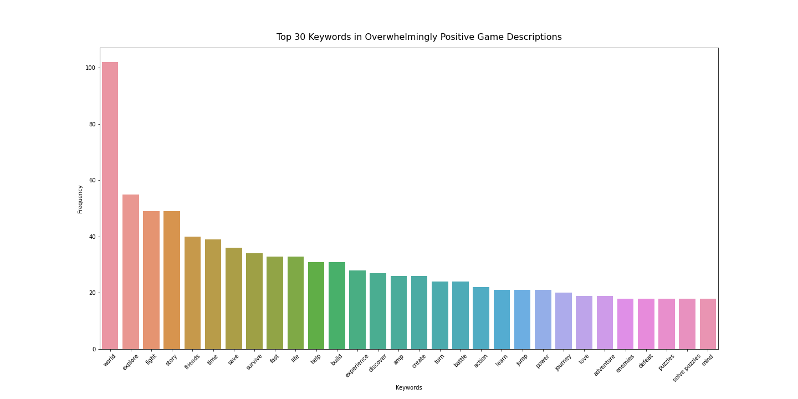
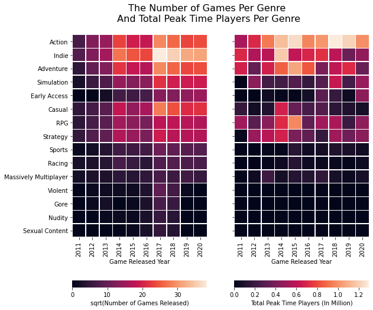
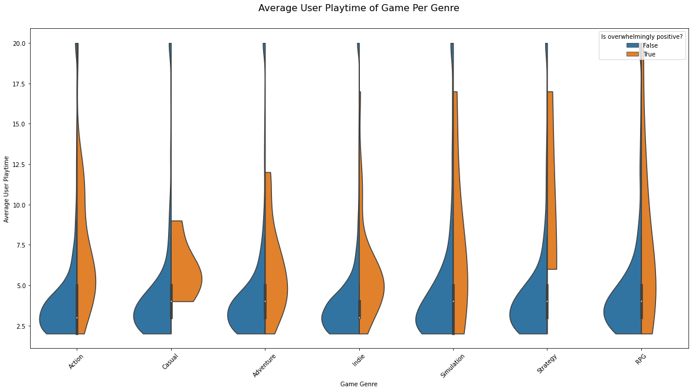
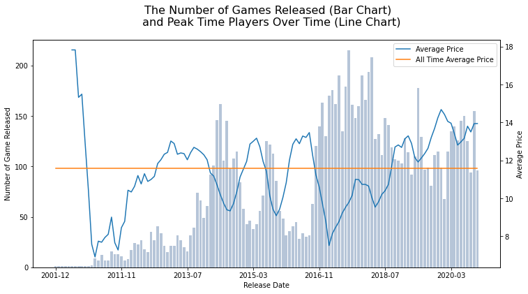
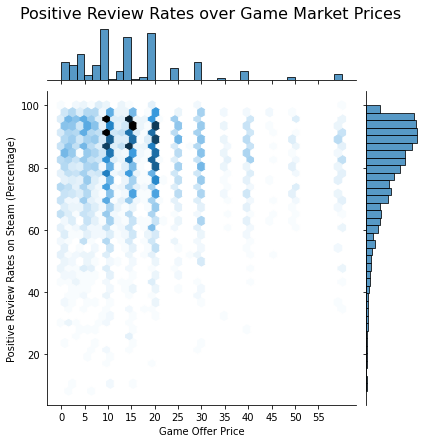
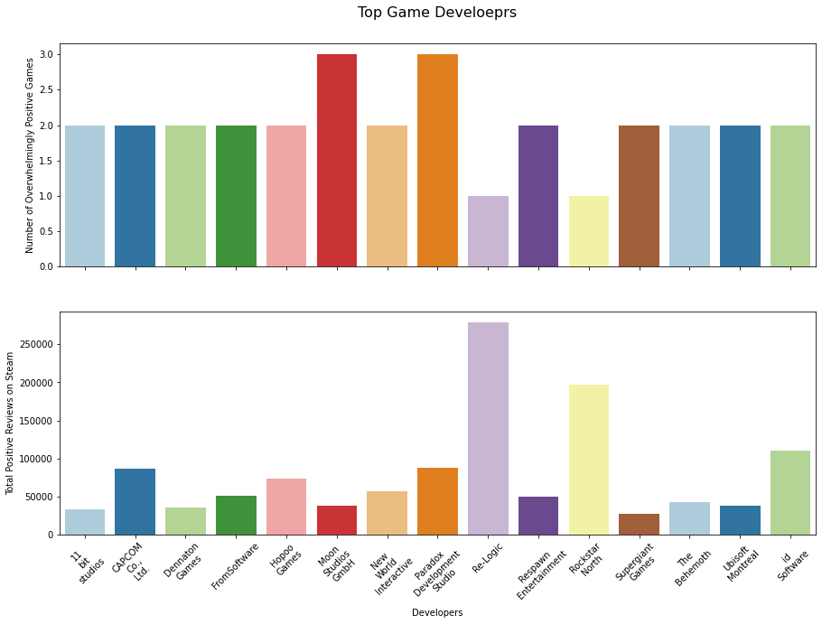

# How to make a “overwhelming positive” game in 2021 by looking at the Steam dataset.

There are over 100,000 games on Steam, but only 47 games are rated “overwhelmingly positive” (receiving more than 10,000 positive reviews with positive review rates over 95%). After analyzing the Steam dataset and especially these 47 overwhelmingly positive games, here is a guide for game developers to create the next big name in video games.

## *“A World of Explorations and Fights”*

To see what is the common theme of most overwhelmingly positive games, I applied keyword extraction to their game descriptions. Top keywords like “world” and “explore” suggest that the open-world mechanism is common among best-rated games. “Story”, “journey” and “adventure” suggest an absorbing game story playings an important part in a good game. “Fight”, “battle”, and “defeat” suggest that the combat elements are essential in modern video games. “Friends” suggest most of these games allow the player to play online with his/her friends.

We can therefore draw a rough portrait of a top-rated game: an open-world game about an adventure story, involving combat elements and support multiplayer mode.

## Game Genre That Players Loved
Knowing the common theme of most top-rated games, we want to learn about which game genre is most popular. The left-hand side of the heatmap below shows how many games of each genre are made from 2011 to 2020, and the right-hand side shows the number of peak-time players playing the game of each genre from 2011 to 2020. We can see that game developers are producing a lot more games than 10 years ago, especially action games, indie games, adventure games, simulations games, and casual games. Most gamers, however, focus on action and adventure games. Despite recent years, there is a huge spike in indie games and casual games production, their player bases stay roughly the same, if not decreasing. So to speak, action games and adventure games are the two popular and evergreen game genres among players.

## “Opening Pitch” For Games
When we look at the average playtime of games, it is surprising to see that for a game that is not rated overwhelmingly positive on steam, an average player will play it only 2–4 hours; for a game that is rated overwhelmingly positive, an average player will play it about 5–7 hours. (Players of simulation game, strategy game, and RPG game tend to play longer.) This means the first 2–4 hour gameplay sets up the “opening pitch” of the game, and the game designers need to attract the players’ eyes within this time range. If a player feels bored in the first 2 hours of a game, he is very less likely to discover the rest of the game’s contents, nor to give positive feedback.

## The Sweetest Price Range
If we look at the time series of games released and their prices, we will find that the more games are released at the same time, the less the average price will be. On average, the price range is between $10–$14. Now the question, what is the price range the players like the most?

The following chart shows the distribution of positive review rates over different game prices. We can see that most games are priced at $9.99, $14.99, and $19.99, their positive review rate distribution are centered at high 95%, and yet some games’ positive review rates could also fall 80%. Games priced under $10 on average have the higher lowest score, but the lower highest score at the same time. We may conclude that while players seem to be more lenient towards games under $10, a game priced at $10–20 is acceptable for most players and it has the potential to get more positive reviews than other price ranges.

## Developers Good at Making Top-Rated Games
Now let’s look at game developers who are good at producing top-rated games. We pick the top 10 game developers who produce the most overwhelmingly positive games on steam. It is amazing to see that Re-Logic and Rockstar North, each of them releasing only one overwhelmingly positive game on Steam, receives more positive reviews than the sum of all other developers who managed to make 2 to 3 top-rated games. It is clear to see that to be the most admired developer, the quality of one game defeats the quantity of games.

> Dataset provided by [Izzy Conner](https://www.kaggle.com/izzyconner) from Kaggle: [Steam Final Video Game Metadata](https://www.kaggle.com/izzyconner/steam-final-video-game-metadata)